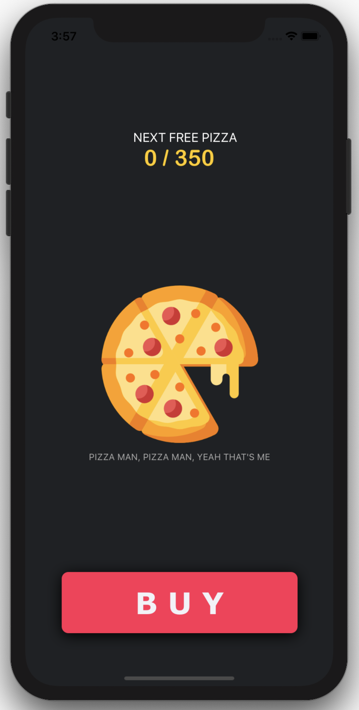
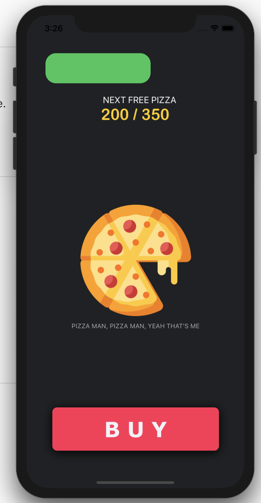
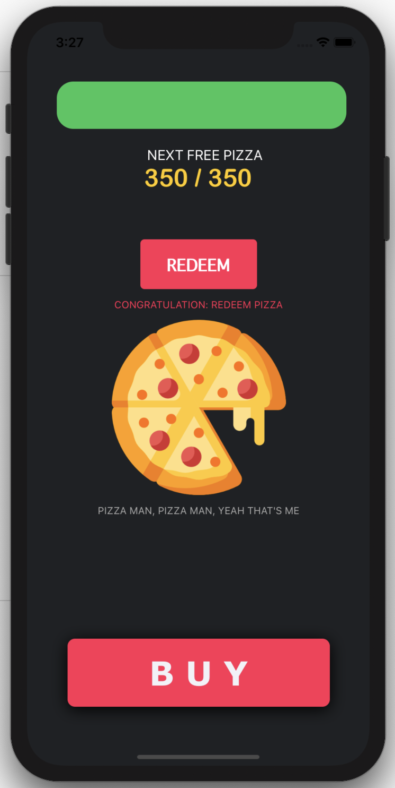

### Property Observal :

#### I made this pizza  progressHud to help me better understand swift property observal.  Feel free to look it up. I tried with the documentation which can be found in the ViewController

