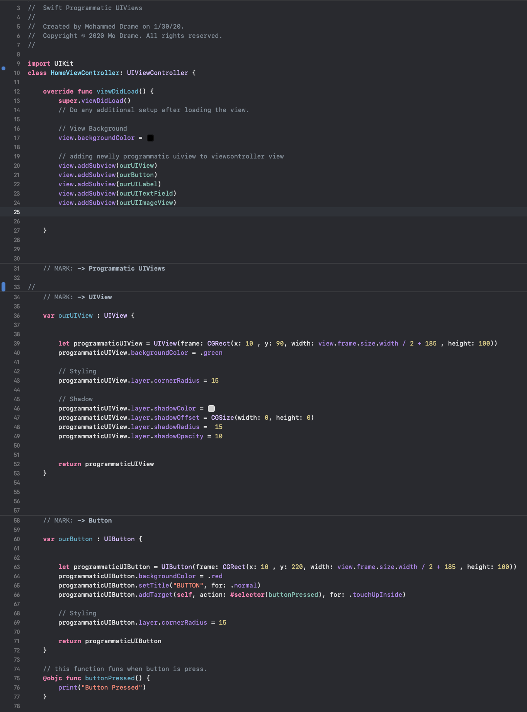

<h1 align="center">
   
  
   
  Begineer Swift Programmatic UIViews  
   
</h1>

  
 

### Description:

* How to create basic swift views programmatically . 

### Technology :

* Swift 

### Build Technique:

* Programmatic

### Todo: 

* Write Programmatic Auto Layout for view and next blog

